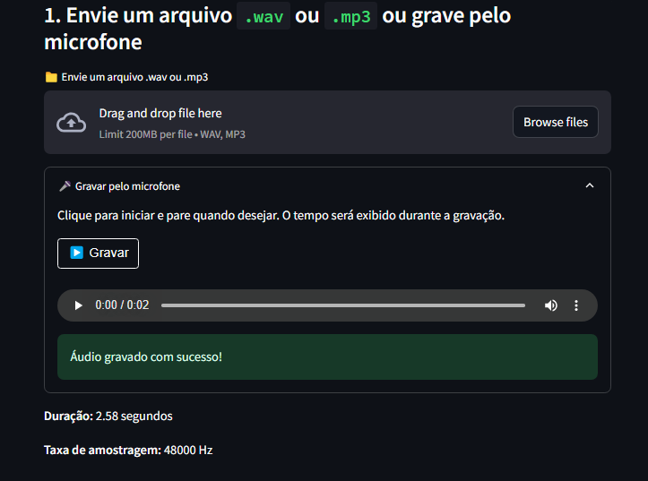
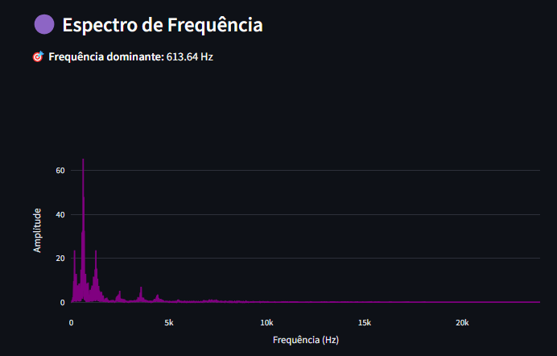
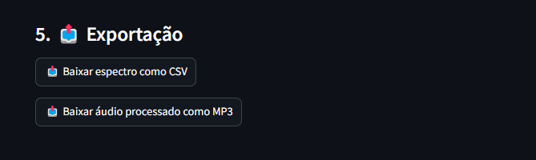

# 🔊 Analisador de Espectro de Áudio

Aplicativo web interativo criado com [Streamlit](https://streamlit.io) para análise e tratamento de ondas sonoras:

- **Gravação e Upload**: Grave áudio via microfone ou envie arquivos `.wav` e `.mp3`
- **Tratamento de Áudio**: Aplique filtros de remoção de ruído e ajuste de ganho
- **Visualização Avançada**: Forma de onda temporal e espectro de frequência interativo
- **Análise em Tempo Real**: Detecção automática da frequência dominante
- **Exportação Completa**: CSV com dados espectrais e áudio processado em MP3

## 🚀 Demonstração

> Interface web responsiva - execute localmente e acesse via navegador.

## 🖼️ Capturas de Tela

| Gravação de Áudio                | Análise Espectral                | Exportação de Dados              |
| --------------------------------- | --------------------------------- | --------------------------------- |
|  |  |  |

## 📦 Requisitos

- **Python**: 3.8 ou superior
- **FFmpeg**: Necessário para processamento de áudio com `pydub`

### Instalação do FFmpeg

**Windows:**
```bash
1. Baixe em: https://ffmpeg.org/download.html
2. Extraia o conteúdo
3. Adicione o caminho da pasta bin ao PATH do sistema
```

**macOS:**
```bash
brew install ffmpeg
```

**Linux (Ubuntu/Debian):**
```bash
sudo apt update && sudo apt install ffmpeg
```

## 📥 Instalação

1. **Clone o repositório:**
```bash
git clone https://github.com/Projeto-Fisica-2025/Analisador-Audio.git
cd Analisador-Audio
```

2. **Configure o ambiente virtual:**
```bash
# Windows
python -m venv .venv
.venv\Scripts\activate

# macOS/Linux
python3 -m venv .venv
source .venv/bin/activate
```

3. **Instale as dependências:**
```bash
pip install -r requirements.txt
```

## ▶️ Executar o App

```bash
streamlit run app.py
```

O navegador será aberto automaticamente em `http://localhost:8501`.

## 🔧 Funcionalidades Principais

### 🎤 Entrada de Áudio
- **Upload de arquivos**: Suporte para `.wav` e `.mp3`
- **Gravação direta**: Interface integrada para gravação via microfone
- **Conversão automática**: MP3 convertido para WAV em memória

### 🧹 Tratamento de Áudio

#### **Remoção de Ruído**
- **Método Automático**: Utiliza `noisereduce` para detecção e remoção inteligente
- **Método Manual**: Filtro espectral com máscara suave configurável
  - Controle de intensidade do ruído (-100dB a 0dB)
  - Transição suave baseada em função sigmoide

#### **Ajuste de Ganho**
- Controle de volume de -20dB a +20dB
- Proteção contra clipping automática
- Conversão dB para fator linear

### 📊 Visualização e Análise

#### **Forma de Onda Temporal**
- Gráfico interativo com Plotly
- Eixo X: Tempo em segundos
- Eixo Y: Amplitude do sinal

#### **Espectro de Frequência**
- Análise FFT em tempo real
- Detecção automática da frequência dominante
- Visualização de 0Hz até Nyquist (metade da taxa de amostragem)

### 📤 Exportação de Dados

#### **Dados Espectrais**
- Arquivo CSV com frequências e amplitudes
- Formato: `espectro_audio.csv`
- Precisão de 4 casas decimais

#### **Áudio Processado**
- Exportação em formato MP3
- Bitrate: 192kbps
- Nome: `audio_processado.mp3`

## 📁 Estrutura do Projeto

```
Analisador-Audio/
├── app.py                    # Aplicativo principal Streamlit
├── requirements.txt          # Dependências Python
├── README.md                 # Documentação do projeto
├── .gitignore               # Arquivos ignorados pelo Git
├── .venv/                   # Ambiente virtual (não versionado)
└── docs/
    └── img/                 # Capturas de tela do README
        ├── gravacao.png
        ├── espectro.png
        └── exportar.png
```

## 🛠️ Tecnologias Utilizadas

- **Streamlit**: Interface web interativa
- **NumPy**: Processamento numérico e FFT
- **SciPy**: Análise de sinais (STFT/ISTFT)
- **Plotly**: Visualizações interativas
- **SoundFile**: Leitura/escrita de arquivos de áudio
- **PyDub**: Conversão de formatos de áudio
- **NoiseReduce**: Redução automática de ruído
- **Pandas**: Manipulação de dados para exportação

## 🎯 Casos de Uso

- **Análise acústica**: Identificação de frequências em gravações
- **Processamento de áudio**: Limpeza e tratamento de sinais
- **Educação**: Demonstração de conceitos de ondas sonoras
- **Pesquisa**: Análise espectral de dados experimentais

## 👥 Autores

Desenvolvido por:
- [Henrique de Almeida Silva](https://github.com/Dev-Henrique-Almeida)
- [Claudierio Baltazar Barra Nova](https://github.com/Claudierio)

---

**Projeto de Física 2025** - Análise e Tratamento de Ondas Sonoras
