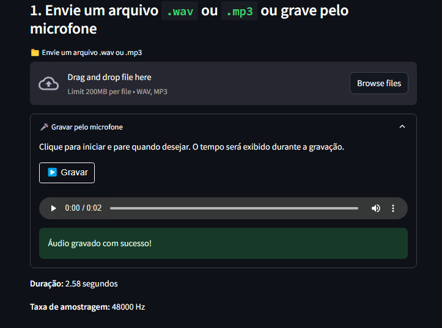
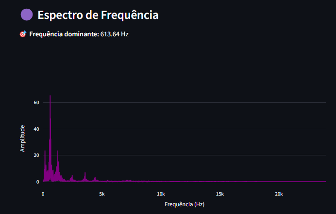

# 🔊 Analisador de Espectro de Áudio

Aplicativo web interativo criado com [Streamlit](https://streamlit.io) para análise e tratamento de ondas sonoras:

- **Gravação e Upload**: Grave áudio via microfone ou envie arquivos `.wav` e `.mp3`
- **Tratamento de Áudio**: Aplique filtros de remoção de ruído, ajuste de ganho e equalização profissional
- **Equalizador Paramétrico**: 10 bandas de frequência com presets profissionais e controle avançado
- **Visualização Avançada**: Forma de onda temporal, espectro de frequência e curva de resposta de EQ
- **Análise em Tempo Real**: Detecção automática da frequência dominante
- **Exportação Completa**: CSV com dados espectrais e áudio processado em MP3

## 🚀 Demonstração

> Interface web responsiva - execute localmente e acesse via navegador.

## 🖼️ Capturas de Tela

| Gravação de Áudio                | Análise Espectral                | Exportação de Dados              |
| --------------------------------- | --------------------------------- | --------------------------------- |
|  |  |  |

## 📦 Requisitos

- **Python**: 3.8 ou superior
- **FFmpeg**: Necessário para processamento de áudio com `pydub`

### Instalação do FFmpeg

**Windows:**
```bash
1. Baixe em: https://ffmpeg.org/download.html
2. Extraia o conteúdo
3. Adicione o caminho da pasta bin ao PATH do sistema
```

**macOS:**
```bash
brew install ffmpeg
```

**Linux (Ubuntu/Debian):**
```bash
sudo apt update && sudo apt install ffmpeg
```

## 📥 Instalação

1. **Clone o repositório:**
```bash
git clone https://github.com/Projeto-Fisica-2025/Analisador-Audio.git
cd Analisador-Audio
```

2. **Configure o ambiente virtual:**
```bash
# Windows
python -m venv .venv
.venv\Scripts\activate

# macOS/Linux
python3 -m venv .venv
source .venv/bin/activate
```

3. **Instale as dependências:**
```bash
pip install -r requirements.txt
```

## 📱 Gerar APK Android

Para criar uma versão mobile Android:

1. **Consulte o guia completo:** [GUIA_APK.md](GUIA_APK.md)

2. **Opção rápida - GitHub Actions:**
   ```bash
   git add .
   git commit -m "Build mobile app"
   git push origin main
   # Vá em Actions no GitHub e baixe o APK
   ```

3. **Teste local (apenas interface):**
   ```bash
   python test_mobile.py
   ```

## ▶️ Executar o App Web

```bash
streamlit run app.py
```

## ▶️ Executar o App com configuracoes otimizadas
```bash
streamlit run app.py --server.maxMessageSize=500 --server.maxUploadSize=500
```


O navegador será aberto automaticamente em `http://localhost:8501`.

## 🔧 Funcionalidades Principais

### 🎤 Entrada de Áudio
- **Upload de arquivos**: Suporte para `.wav` e `.mp3`
- **Gravação direta**: Interface integrada para gravação via microfone
- **Conversão automática**: MP3 convertido para WAV em memória

### 🧹 Tratamento de Áudio

#### **Remoção de Ruído**
- **Método Automático**: Utiliza `noisereduce` para detecção e remoção inteligente
- **Método Manual**: Filtro espectral com máscara suave configurável
  - Controle de intensidade do ruído (-100dB a 0dB)
  - Transição suave baseada em função sigmoide

#### **Ajuste de Ganho**
- Controle de volume de -20dB a +20dB
- Proteção contra clipping automática
- Conversão dB para fator linear

#### **Equalizador Paramétrico Profissional**
- **10 bandas de frequência**: 31Hz, 62Hz, 125Hz, 250Hz, 500Hz, 1kHz, 2kHz, 4kHz, 8kHz, 16kHz
- **Presets Profissionais**: 
  - Rock, Pop, Jazz, Classical, Electronic
  - Vocal Enhancement, Bass Boost, Treble Boost
  - Presence e Flat (Neutro)
- **Controles Avançados**:
  - Q-Factor ajustável (0.1 a 5.0) para largura da banda
  - Compensação automática de ganho
  - Proteção contra distorção
- **Visualização em Tempo Real**:
  - Curva de resposta de frequência interativa
  - Marcadores das bandas ativas
  - Escala logarítmica profissional
- **Algoritmo Biquad**: Filtros peaking de alta qualidade
- **Interface Intuitiva**: Layout em duas colunas com controles dedicados

### 📊 Visualização e Análise

#### **Forma de Onda Temporal**
- Gráfico interativo com Plotly
- Eixo X: Tempo em segundos
- Eixo Y: Amplitude do sinal

#### **Espectro de Frequência**
- Análise FFT em tempo real
- Detecção automática da frequência dominante
- Visualização de 0Hz até Nyquist (metade da taxa de amostragem)

#### **Curva de Resposta do Equalizador**
- Visualização em tempo real das modificações
- Escala logarítmica de 20Hz a 20kHz
- Marcadores visuais das bandas ativas
- Linha de referência em 0dB

## 🎛️ Equalizador Paramétrico - Guia Completo

### Bandas de Frequência

| Frequência | Nome | Descrição | Uso Típico |
|------------|------|-----------|-------------|
| **31 Hz** | Sub-Bass | Frequências muito graves | Reforço de bateria, efeitos |
| **62 Hz** | Bass | Graves fundamentais | Baixo, bumbo, fundação |
| **125 Hz** | Low-Mid | Médio-graves | Warmth, corpo dos instrumentos |
| **250 Hz** | Mid-Bass | Transição médio-grave | Definição de baixo, vocais |
| **500 Hz** | Midrange | Médios centrais | Fundamentais vocais |
| **1 kHz** | Presence | Presença | Clareza vocal, inteligibilidade |
| **2 kHz** | Clarity | Clareza | Definição, articulação |
| **4 kHz** | Brilliance | Brilho | Presença, mordida |
| **8 kHz** | Air | Ar/respiração | Sibilância, detalhes |
| **16 kHz** | Sparkle | Brilho extremo | Harmonics, espacialidade |

### Presets Profissionais

- **🎸 Rock**: Médios agressivos, graves potentes, agudos brilhantes
- **🎤 Pop**: Vocais realçados, graves controlados, agudos suaves
- **🎷 Jazz**: Resposta natural, médios aquecidos, graves definidos
- **🎼 Classical**: Resposta linear, dinâmica preservada
- **🎹 Electronic**: Graves estendidos, agudos cristalinos
- **🗣️ Vocal Enhancement**: Frequências de fala otimizadas
- **🔊 Bass Boost**: Reforço de graves para sistemas pequenos
- **✨ Treble Boost**: Clareza e definição aumentadas
- **🎯 Presence**: Foco nas frequências de presença


### 📤 Exportação de Dados

#### **Dados Espectrais**
- Arquivo CSV com frequências e amplitudes
- Formato: `espectro_audio.csv`
- Precisão de 4 casas decimais

#### **Áudio Processado**
- Exportação em formato MP3
- Bitrate: 192kbps
- Nome: `audio_processado.mp3`

## 📁 Estrutura do Projeto

```
Analisador-Audio/
├── app.py                    # Aplicativo principal Streamlit
├── requirements.txt          # Dependências Python
├── README.md                 # Documentação do projeto
├── .gitignore               # Arquivos ignorados pelo Git
├── .venv/                   # Ambiente virtual (não versionado)
└── docs/
    └── img/                 # Capturas de tela do README
        ├── gravacao.png
        ├── espectro.png
        └── exportar.png
```

## 🛠️ Tecnologias Utilizadas

- **Streamlit**: Interface web interativa
- **NumPy**: Processamento numérico e FFT
- **SciPy**: Análise de sinais (STFT/ISTFT) e filtros biquad
- **Plotly**: Visualizações interativas e curvas de resposta
- **SoundFile**: Leitura/escrita de arquivos de áudio
- **PyDub**: Conversão de formatos de áudio
- **NoiseReduce**: Redução automática de ruído
- **Pandas**: Manipulação de dados para exportação

### Algoritmos de Processamento

- **FFT (Fast Fourier Transform)**: Análise espectral
- **STFT (Short-Time Fourier Transform)**: Redução de ruído espectral
- **Filtros Biquad**: Equalização paramétrica de alta qualidade
- **Máscaras Espectrais**: Redução inteligente de ruído
- **Compressão Adaptativa**: Proteção contra clipping

## 🎯 Casos de Uso

- **Análise acústica**: Identificação de frequências em gravações
- **Processamento de áudio profissional**: Equalização e masterização de áudio
- **Educação**: Demonstração de conceitos de ondas sonoras e filtragem
- **Pesquisa**: Análise espectral de dados experimentais
- **Produção musical**: Aplicação de presets e ajustes de EQ
- **Tratamento de gravações**: Limpeza e melhoria da qualidade sonora

## 👥 Autores

Desenvolvido por:
- [Henrique de Almeida Silva](https://github.com/Dev-Henrique-Almeida)
- [Claudierio Baltazar Barra Nova](https://github.com/Claudierio)

---

**Projeto de Física 2025** - Análise e Tratamento de Ondas Sonoras